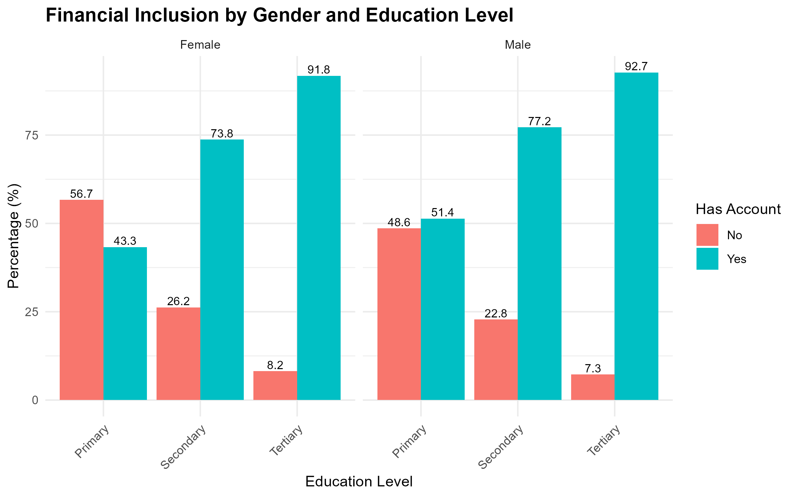
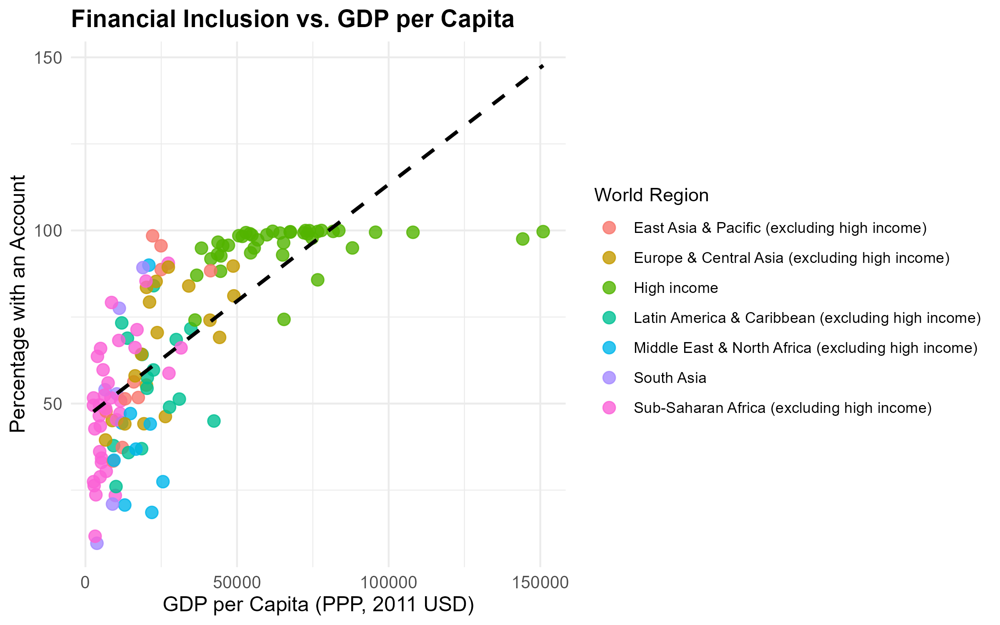

---
layout: post
title: Global Findex Financial Inclusion Analysis
description: R Studio Analysis
image: assets/images/pic11.jpg
nav-menu: true
---
<h2>Task Overview</h2>

This project analyzes microdata from 2021 to explore financial inclusion trends.

Perform the following tasks in RStudio:

<ul>
<li>Operationalization and data preparation</li>
<li>Descriptive statistics
<ul>
<li>Bar plot</li>
<li>Scatter plot</li>
</ul>
</li>
<li>Inferential statistics
<ul>
<li>OLS linear regression</li>
</ul>
</li>
</ul>

<h2>Data source</h2>

The Micro-Dataset and related resources come from:

<strong>The Global Findex Database 2021: Financial Inclusion, Digital Payments, and Resilience in the Age of COVID-19</strong>

<a href="https://www.worldbank.org/en/publication/globalfindex" target="_blank">https://www.worldbank.org/en/publication/globalfindex</a>

<strong>The Macro data (country-level) comes from the World Bank Development Indicators
<strong>

<a href="https://databank.worldbank.org/reports.aspx?source=2&country=ARE" target="_blank">https://databank.worldbank.org/reports.aspx?source=2&country=ARE</a>

<h2>Plots</h2>

<h3>Financial Inclusion by Gender and Education Level</h3>

<h3>Financial Inclusion vs GDP per Capita</h3>

<h2>Results</h2>

Both GDP_PPP and Life_expectancy are highly significant predictors of percent_with_account, with p-values < 2e-16.

The model explains about 43.1% of the variation in account ownership across countries (R-squared = 0.4314).

The coefficients suggest that higher GDP_PPP and longer life expectancy are associated with increased account ownership.

<h2>How to use</h2>

Open the R project file in RStudio and run the scripts.

📄 <a href="https://github.com/hardehboy/MyRProject" target="_blank">
View R script on GitHub
</a>

